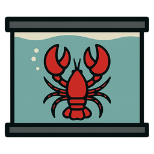

<p align="center">
  
</p>

<h1 align="center">CageClaw</h1>

<p align="center">
  <strong>Sandbox your AI coding agent</strong><br>
  Network isolation, domain allowlists, and real-time traffic monitoring for OpenClaw.
</p>

<p align="center">
  <a href="https://github.com/Digital-Signet/cageclaw/releases">Download</a> &middot;
  <a href="https://cageclaw.com">Website</a> &middot;
  <a href="https://github.com/Digital-Signet/cageclaw/issues">Issues</a>
</p>

---

## The problem

AI coding agents run arbitrary code on your machine. They can read your SSH keys, exfiltrate source code, install backdoors, or phone home to any server. You're trusting a model you don't control with full access to your dev environment.

## What CageClaw does

CageClaw wraps OpenClaw inside an isolated Docker container and forces all network traffic through a local proxy with a domain allowlist. Nothing gets in or out without your approval.

- **Network isolation** — The container runs on a Docker internal network with no default gateway. Even hardcoded IP addresses get "Network unreachable".
- **Domain allowlist** — All outbound traffic goes through a proxy that checks every request against your allowlist. Only approved domains get through.
- **Traffic monitoring** — Every HTTP request is logged with method, host, bytes, and status. A live dashboard shows what your agent is doing on the network.
- **File mount protection** — Sensitive paths (`.ssh`, `.aws`, `.gnupg`, browser profiles, credential stores) are blocked from being mounted into the container.
- **Least privilege** — Containers drop all Linux capabilities, run non-root with `no-new-privileges`, read-only root filesystem, and enforced memory/CPU limits.

## Requirements

- Windows 10/11 (x64)
- [Docker Desktop](https://www.docker.com/products/docker-desktop/) running

## Install

Download the `.msi` or `-setup.exe` from the [latest release](https://github.com/Digital-Signet/cageclaw/releases) and run it.

## Build from source

```bash
# Prerequisites: Node.js 22+, Rust (stable), Docker Desktop

# Clone
git clone https://github.com/Digital-Signet/cageclaw.git
cd cageclaw

# Install frontend dependencies
npm ci

# Run in dev mode
npm run tauri dev

# Build for production
npm run tauri build
```

## How it works

```
Host browser --> localhost:18790 --> [Sidecar] ---(isolated net)---> [OpenClaw container]
                                        |
OpenClaw --> HTTP_PROXY --> [Sidecar] ---(bridge)---> host:18791 --> CageClaw Proxy
                                                                        |
                                                                   Domain allowlist
                                                                   Traffic logging
```

1. **Isolated network** — CageClaw creates a Docker internal bridge network. Containers on this network have no route to the internet.
2. **Proxy sidecar** — A lightweight sidecar sits on both the isolated and normal bridge networks. It forwards the agent UI to your browser and routes outbound traffic to the CageClaw proxy.
3. **Domain filtering** — The host-side proxy checks every CONNECT and HTTP request against your domain allowlist. Allowed traffic passes through; everything else is rejected and logged.

## Tech stack

- **Desktop app** — [Tauri v2](https://tauri.app/) (Rust backend, React + TypeScript frontend)
- **Container orchestration** — [bollard](https://crates.io/crates/bollard) (Docker API)
- **Proxy** — Rust forward proxy using [hyper](https://hyper.rs/) 1.x
- **Database** — SQLite with WAL mode for traffic logging

## Status

Alpha release. Functional but not yet security audited. Use at your own risk.

Default domain allowlist includes: `api.anthropic.com`, `api.openai.com`, `generativelanguage.googleapis.com`, `registry.npmjs.org`.

## License

[Apache 2.0](LICENSE)

## Built by

[Digital Signet](https://digitalsignet.com) — AI products and strategic technology consulting, London.
